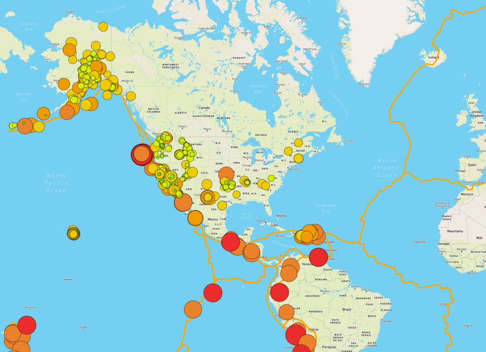
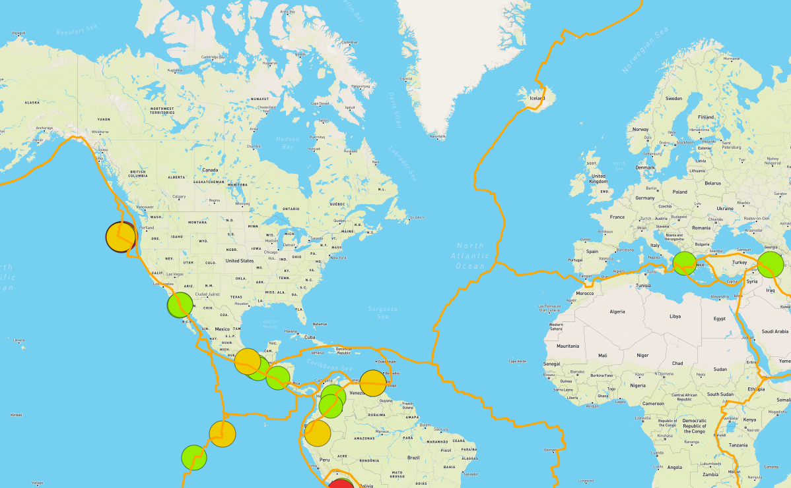
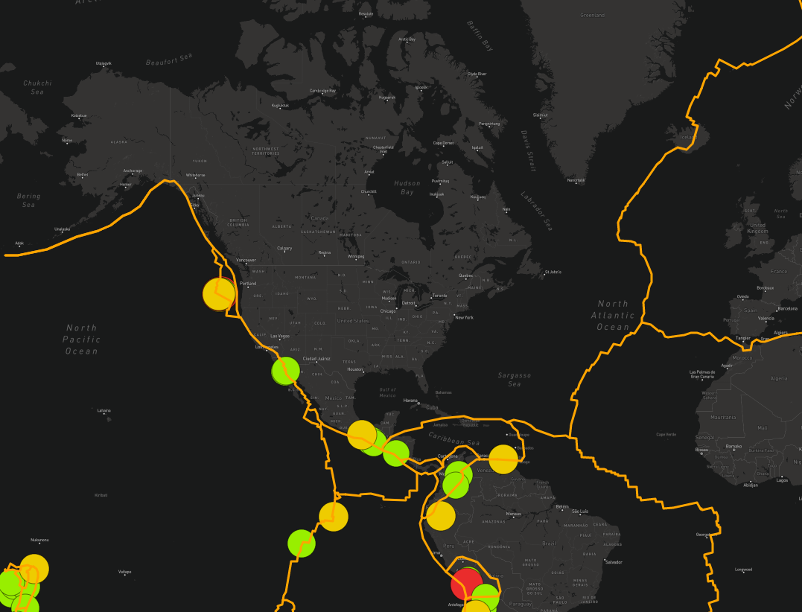

# Mapping_Earthquakes
Mapping Earthquakes in the last week, along with tectonic plates, and a layer for just earthquakes over 4.5 in the last week.
Several layers including light, dark, satellite, and street views.

## Overview of Project
Create a map that displays earthquake data from the last week. Include borders for tectonic plates and color ranges for the intensity of earthquakes.

## Results
 

*Map showing **all earthquake data** for the last week and **tectonic borders***

 

*Map showing **earthquake data over 4.5** for the last week and **tectonic borders***
Excludes all data although it is available.
***Note:* Because there were no earthquakes over 6, I changed the criteria from 6 to 5.5.**

 

*Map showing the same as above **earthquake data over 4.5** for the last week and **tectonic borders** with a dark map base*
